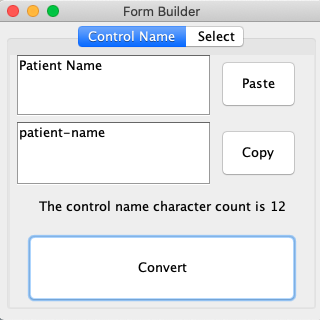
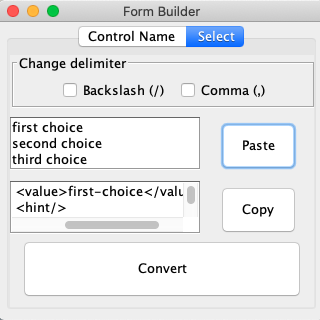

# Form Builder Assistant
## Purpose 
The app is to help in the development of eforms using the Orbeon Form builder. It has two different function separated by tabs. 
  1. It can create back end control names from the field names, removing special symbols and capital letters.
  2. It can generate the single select code that makes up single selects. Also removing capitals and special characters from the back-end values. 
  
       

## How it works 
### Control Tab

   1. Place the text you wish to convert into the first text box 
      * If you do this using the paste button then conversion will automatically complete. 
   2. The press convert to convert the text. 
   3. Press copy to copy the text from second text box to your clipboard

### Select Tab
The select options can be separated my many different delimiters. The default is newline separation. To change the delimiter, select the relevant option form the menu. To return to newline separation deselect all of the other options. 
  
   1. Select relevant delimiter. 
   2. Place the text you wish to convert into the first text box 
      * If you do this using the paste button then conversion will automatically complete. 
   2. The press convert to convert the text. 
   3. Press copy to copy the text from second text box to your clipboard
